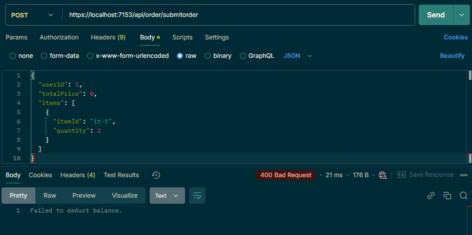
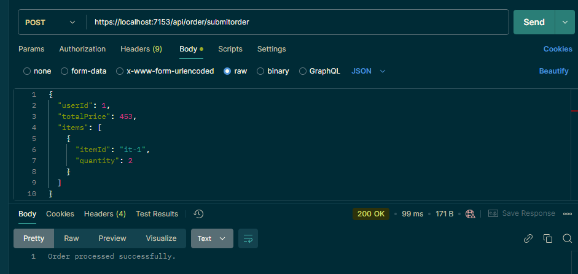
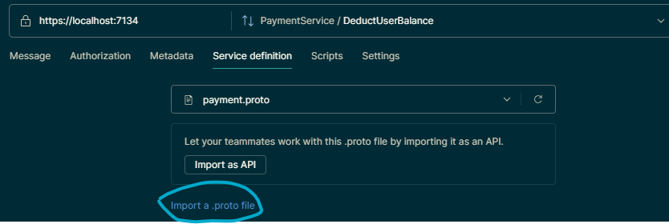
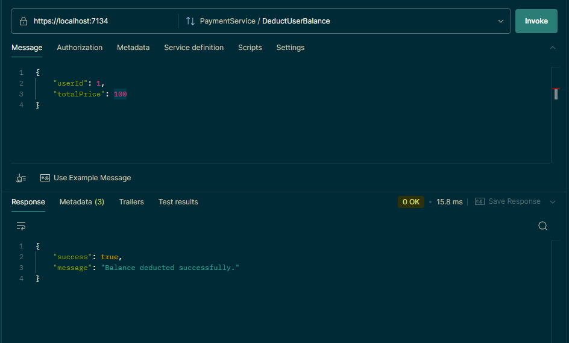

# gRPC-Demo Project

This repository demonstrates the use of gRPC for internal service-to-service communication and REST API for external client interactions in an ASP.NET Core environment.

---

## Features

- **gRPC Services**: Internal communication using gRPC for high performance and efficient message exchange.
- **REST API**: External communication using REST endpoints.
- **Layered Architecture**: Separation of concerns between services like `OrderingService`, `PaymentService`, and `InventoryService`.

---

## Usage

### REST API Endpoints

The REST API is exposed via the `OrderingService`. Use the following endpoints:

- **Submit Order**: `POST /api/order`
- **Retrieve Order Details**: `GET /api/order/{id}`

### gRPC Services

The `PaymentService` and `InventoryService` are accessed internally using gRPC. Protobuf files define the contract between services.

---

## Postman Usage

The REST API request using Postman

- failed request

- fullfilled request

and also you can consume the gRPC using postman

- in the service definition tab import the .proto file

- then select the method and write the message and click invoke

